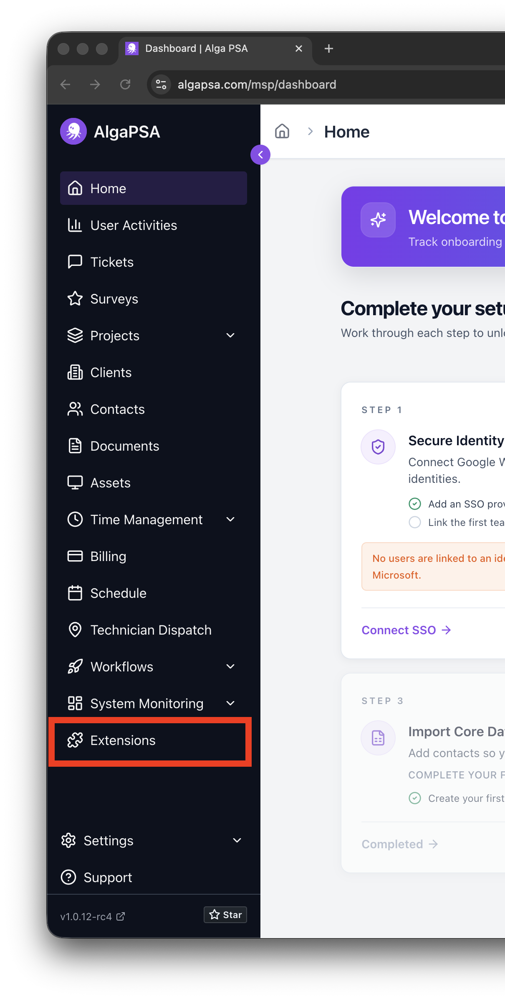
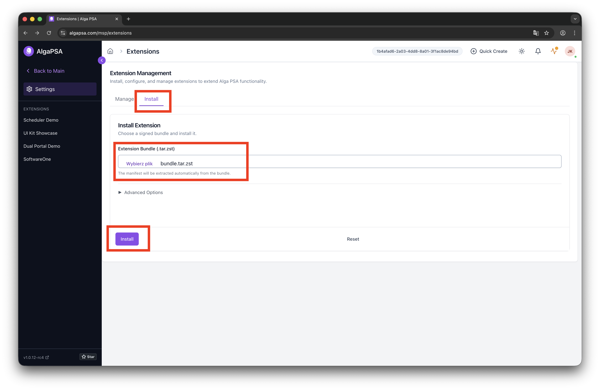
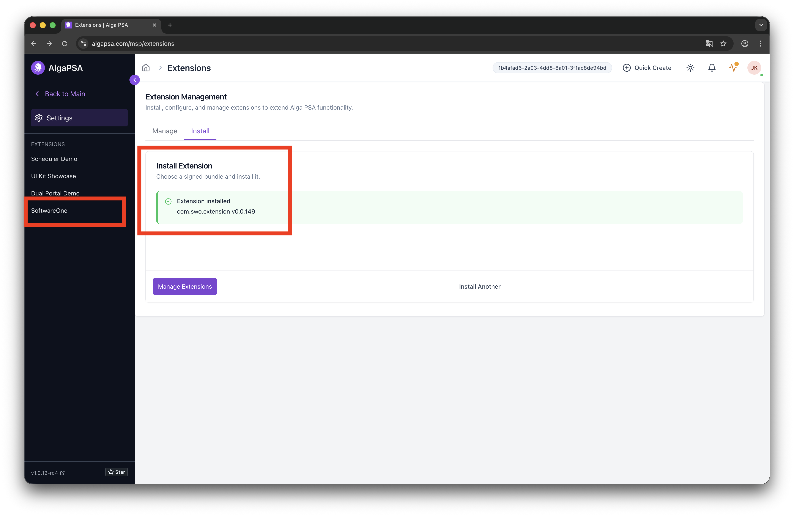
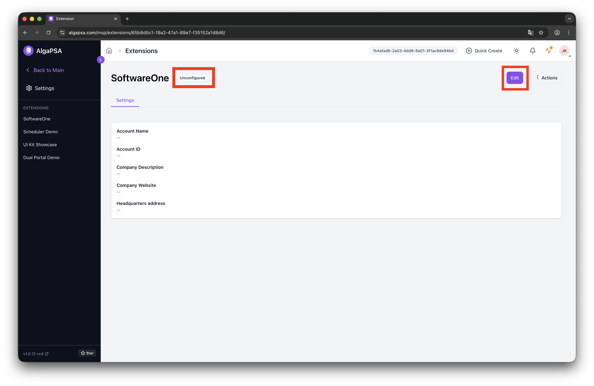
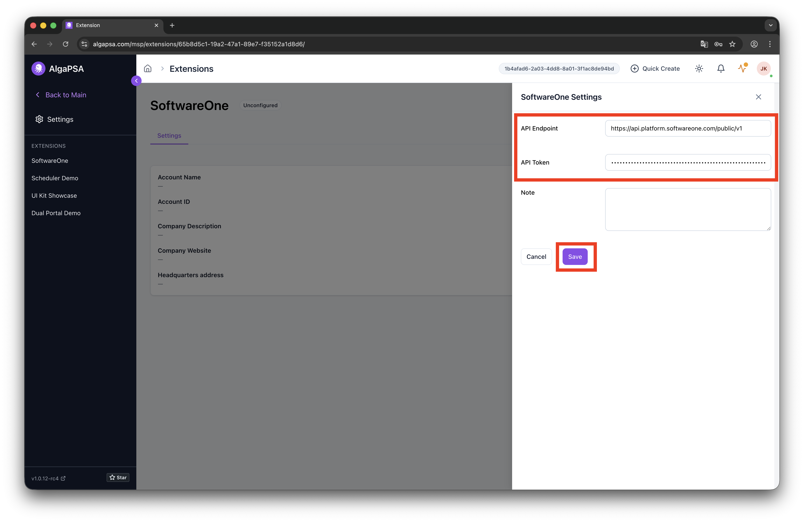
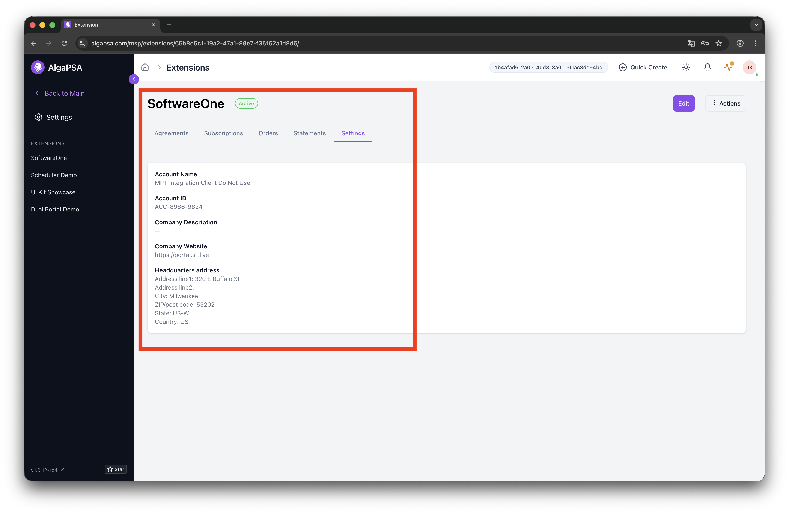

# SoftwareOne Extension — Installation & Configuration Guide

## Prerequisites

- Access to the AlgaPSA MSP portal
- The extension bundle file (`bundle.tar.zst`) downloaded from <DOWNLOAD_LINK>
- A SoftwareOne API Token (generated in the SoftwareOne Portal)

## Installation

### Step 1: Open the Extensions menu

Sign in to the AlgaPSA MSP portal and navigate to **Extensions** in the left sidebar.

### Step 2: Upload and install the extension bundle

Switch to the **Install** tab. In the **Extension Bundle** field, select the `bundle.tar.zst` file downloaded in the prerequisites. Click **Install**.

### Step 3: Verify the installation

Wait for the installation to complete. A green **Extension installed** confirmation will appear, along with the installed version. You should also see **SoftwareOne** listed under Extensions in the left sidebar. Click on it to proceed.

## Configuration

### Step 4: Open the extension settings

The extension will initially show an **Unconfigured** status. Click **Edit** to open the configuration drawer.

### Step 5: Provide API credentials

In the configuration drawer, fill in the following fields:

- **API Endpoint**: `https://api.platform.softwareone.com/public/v1`
- **API Token**: Paste the token generated in the SoftwareOne Portal

Click **Save** to apply the configuration.

### Step 6: Confirm the extension is active

Once configured, the extension status will change to **Active**. The Settings tab will display your account details, and additional tabs — **Agreements**, **Subscriptions**, **Orders**, and **Statements** — will become available.

---

The SoftwareOne extension is now installed and ready to use.
